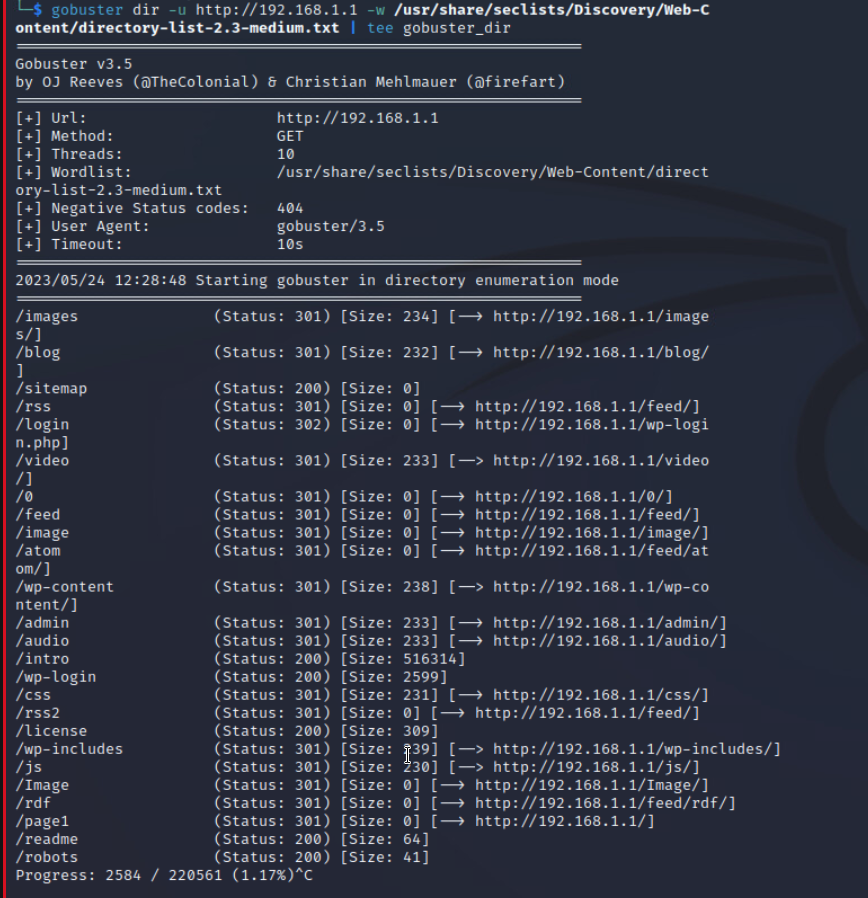
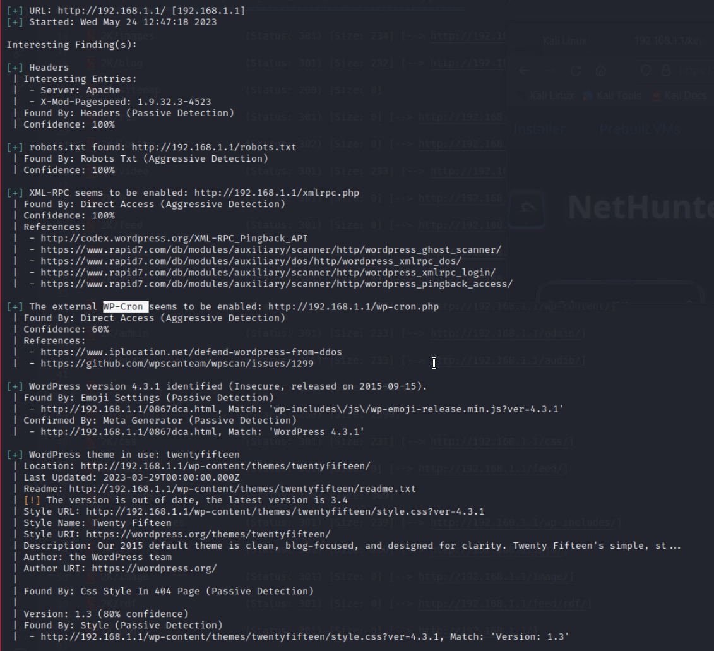
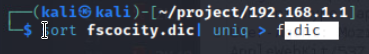
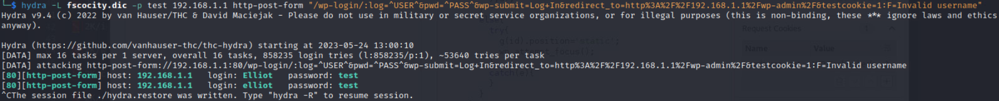
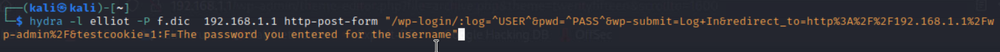

# Information Gathering

  

### Nmap


http-server with several videos and texts from the Mr. Robot series


## Enumeration

### Nikto

```bash
nikto -h http://192.168.1.1 > nikito
```
->nothing really interesting
wordpress- blog

### gobuster


-> intersting /wp-login -site
-> /robot
### wpscan

--> robots.txt with key-1-of-3.txt and fscocity.dic
key-1-of-3.txt: md5 hash
fscocity.dic: dictinary with usernames and password


because of many duplicates in the dict

![[Pasted image 20230524132712.png]]

# Exploitation
Find out username for wp-login
Get Post-String from Burpsuite.
Use http-post-form module from Hydra
Find out username for wp-login:

Find out password for wp-login:

`elliot:ER28-0652`

Two ways to build in a php-rev shell:
- as 404.php template in the themes
- as a faulty plugin


# Privilege Escaltion


  
  

---

  

# References

  


  

<br>

  

___─ Written by MatDef ─___